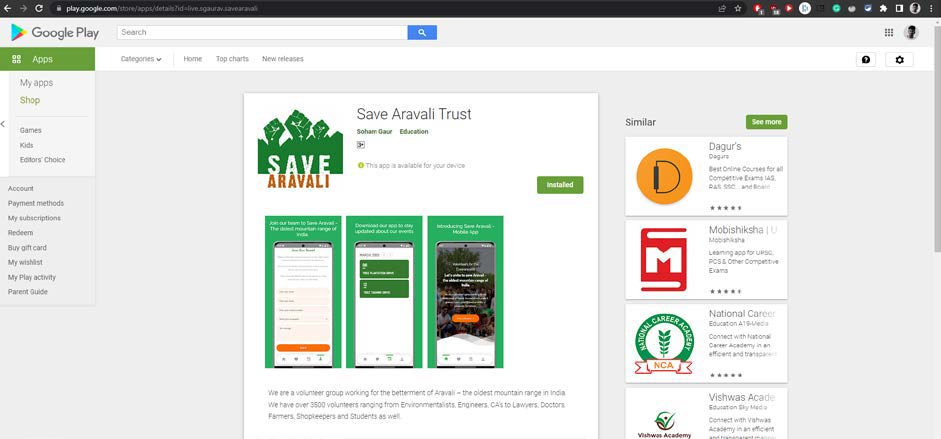

<!-- Improved compatibility of back to top link: See: https://github.com/othneildrew/Best-README-Template/pull/73 -->

<!--
*** Thanks for checking out the Best-README-Template. If you have a suggestion
*** that would make this better, please fork the repo and create a pull request
*** or simply open an issue with the tag "enhancement".
*** Don't forget to give the project a star!
*** Thanks again! Now go create something AMAZING! :D
-->

<!-- PROJECT SHIELDS -->
<!--
*** I'm using markdown "reference style" links for readability.
*** Reference links are enclosed in brackets [ ] instead of parentheses ( ).
*** See the bottom of this document for the declaration of the reference variables
*** for contributors-url, forks-url, etc. This is an optional, concise syntax you may use.
*** https://www.markdownguide.org/basic-syntax/#reference-style-links
-->
[![Contributors][contributors-shield]][contributors-url]
[![Forks][forks-shield]][forks-url]
[![Stargazers][stars-shield]][stars-url]
[![Issues][issues-shield]][issues-url]
[![MIT License][license-shield]][license-url]
[![LinkedIn][linkedin-shield]][linkedin-url]

<!-- PROJECT LOGO -->
 

  

<h3 align="center">Save Aravali Mobile App</h3>

  

This GitHub repository contains the code for the Save Aravali Trust mobile app, a cross-platform Flutter application with a WordPress backend. The app allows the NGO to connect with volunteers, share information about events, and showcase their mission and achievements. It features social media integration, an event page, and a contact section for volunteering and donations. This app aims to streamline communication and engagement for the Save Aravali Trust's initiatives in protecting and preserving the Aravali range.
     
    <a href="https://github.com/knowgaurav/save-aravali-mobile-app">View Demo</a>
    ·
    <a href="https://github.com/knowgaurav/save-aravali-mobile-app/issues">Report Bug</a>
    ·
    <a href="https://github.com/knowgaurav/save-aravali-mobile-app/issues">Request Feature</a>
  

<!-- TABLE OF CONTENTS -->

  
Table of Contents

  <ol>
    <li>
      <a href="#about-the-project">About The Project</a>
      <ul>
        <li><a href="#built-with">Built With</a></li>
      </ul>
    </li>
    <li><a href="#usage">About</a></li>
    <li><a href="#license">License</a></li>
    <li><a href="#contact">Contact</a></li>
    <li><a href="#acknowledgments">Acknowledgments</a></li>
  </ol>

<!-- ABOUT THE PROJECT -->
## About The Project

  

  

  

(<a href="#readme-top">back to top</a>)

### Built With

* 
* 
* 

(<a href="#readme-top">back to top</a>)

<!-- GETTING STARTED -->
## Details

**Save Aravali Trust Mobile App - Personal Project**

This GitHub repository contains the code for the Save Aravali Trust mobile app, which was my personal project undertaken while working for the Save Aravali NGO. The app serves as a powerful tool to connect the NGO with its volunteers and share essential information about events and initiatives.

**App Overview:**
The Save Aravali Trust mobile app was developed with the primary goal of facilitating seamless communication between the NGO and its volunteers. It provides comprehensive information about the NGO's mission, achievements, and upcoming events. The app also features a social media integration section, showcasing real-time updates from the NGO's various social media channels, enabling users to stay informed about the latest happenings.

**Key Features:**
- **NGO Information**: The app offers detailed insights into the Save Aravali Trust, providing a comprehensive overview of its objectives and accomplishments. This section aims to raise awareness about the NGO's noble cause.

- **Social Media Integration**: The social media view presents a consolidated feed of all the NGO's social media channels, allowing volunteers to stay updated on the organization's activities and share posts easily.

- **Event Page**: The app boasts an event page that displays all the upcoming events organized by the Save Aravali Trust. Users can access event details, view schedules, and register for events through the app, enhancing participation and engagement.

- **Contact and Volunteer**: To encourage more people to contribute to the cause, the app features a contact page that simplifies the process of signing up as a volunteer or making donations.

**Technology Stack:**
The app is built using Flutter and Dart, leveraging the advantages of this powerful cross-platform framework to create a unified application for both Android and iOS devices. Additionally, the app is integrated with a WordPress backend, providing a user-friendly content management system for the NGO team to manage event schedules, content, and other crucial aspects.

**Project Success:**
During my tenure at the Save Aravali NGO, I took up the initiative to develop this mobile app to streamline communication and enhance volunteer engagement. The project was successfully completed within the designated timeline, and the app was published on the Google Play Store, making it easily accessible to the NGO's target audience.

**Future Scope:**
As my personal project, I remain committed to continuously improving the Save Aravali Trust mobile app. I intend to address feedback and suggestions from the NGO's stakeholders to enhance the app's functionality and user experience. Additionally, I look forward to exploring new features and integrations that can further boost the NGO's reach and impact.

**Contributions:**
I welcome contributions from the open-source community to join me in refining and expanding the capabilities of the Save Aravali Trust mobile app. Together, we can support the NGO in its mission to protect and preserve the Aravali range and make a positive impact on the environment.

Join me on this GitHub repository as we collaborate to drive positive change and empower the Save Aravali Trust in its noble cause. Your contributions can make a real difference in safeguarding this invaluable natural treasure for generations to come.

(<a href="#readme-top">back to top</a>)

<!-- LICENSE -->
## License

Distributed under the MIT License. See `LICENSE.txt` for more information.

(<a href="#readme-top">back to top</a>)

<!-- CONTACT -->
## Contact

Gaurav Singh - [@knowgaurav01](https://twitter.com/knowgaurav01) - hello@sgaurav.me

Project Link: [https://github.com/knowgaurav/save-aravali-mobile-app](https://github.com/github_username/interview-prep)

(<a href="#readme-top">back to top</a>)

<!-- ACKNOWLEDGMENTS -->
## Acknowledgments

* [Save Aravali](https://www.savearavali.org/)

(<a href="#readme-top">back to top</a>)

<!-- MARKDOWN LINKS & IMAGES -->
<!-- https://www.markdownguide.org/basic-syntax/#reference-style-links -->
[contributors-shield]: https://img.shields.io/github/contributors/knowgaurav/save-aravali-mobile-app.svg?style=for-the-badge
[contributors-url]: https://github.com/knowgaurav/save-aravali-mobile-app/graphs/contributors
[forks-shield]: https://img.shields.io/github/forks/knowgaurav/save-aravali-mobile-app.svg?style=for-the-badge
[forks-url]: https://github.com/knowgaurav/save-aravali-mobile-app/network/members
[stars-shield]: https://img.shields.io/github/stars/knowgaurav/save-aravali-mobile-app.svg?style=for-the-badge
[stars-url]: https://github.com/knowgaurav/save-aravali-mobile-app/stargazers
[issues-shield]: https://img.shields.io/github/issues/knowgaurav/save-aravali-mobile-app.svg?style=for-the-badge
[issues-url]: https://github.com/knowgaurav/save-aravali-mobile-app/issues
[license-shield]: https://img.shields.io/github/license/knowgaurav/save-aravali-mobile-app.svg?style=for-the-badge
[license-url]: https://github.com/knowgaurav/save-aravali-mobile-app/blob/master/LICENSE.txt
[linkedin-shield]: https://img.shields.io/badge/-LinkedIn-black.svg?style=for-the-badge&logo=linkedin&colorB=555
[linkedin-url]: https://in.linkedin.com/in/knowgaurav
[product-screenshot]: images/screenshot.png
[Next.js]: https://img.shields.io/badge/next.js-000000?style=for-the-badge&logo=nextdotjs&logoColor=white
[Next-url]: https://nextjs.org/
[React.js]: https://img.shields.io/badge/React-20232A?style=for-the-badge&logo=react&logoColor=61DAFB
[React-url]: https://reactjs.org/
[Vue.js]: https://img.shields.io/badge/Vue.js-35495E?style=for-the-badge&logo=vuedotjs&logoColor=4FC08D
[Vue-url]: https://vuejs.org/
[Angular.io]: https://img.shields.io/badge/Angular-DD0031?style=for-the-badge&logo=angular&logoColor=white
[Angular-url]: https://angular.io/
[Svelte.dev]: https://img.shields.io/badge/Svelte-4A4A55?style=for-the-badge&logo=svelte&logoColor=FF3E00
[Svelte-url]: https://svelte.dev/
[Laravel.com]: https://img.shields.io/badge/Laravel-FF2D20?style=for-the-badge&logo=laravel&logoColor=white
[Laravel-url]: https://laravel.com
[Bootstrap.com]: https://img.shields.io/badge/Bootstrap-563D7C?style=for-the-badge&logo=bootstrap&logoColor=white
[Bootstrap-url]: https://getbootstrap.com
[JQuery.com]: https://img.shields.io/badge/jQuery-0769AD?style=for-the-badge&logo=jquery&logoColor=white
[JQuery-url]: https://jquery.com 
[C++]: https://img.shields.io/badge/c++-%2300599C.svg?style=for-the-badge&logo=c%2B%2B&logoColor=white
[C++-url]: https://isocpp.org/
[Codeforces]: https://img.shields.io/badge/Codeforces-445f9d?style=for-the-badge&logo=Codeforces&logoColor=white
[Codeforces-url]: https://codeforces.com/
[LeetCode]: https://img.shields.io/badge/LeetCode-000000?style=for-the-badge&logo=LeetCode&logoColor=#d16c06
[LeetCode-url]: https://leetcode.com